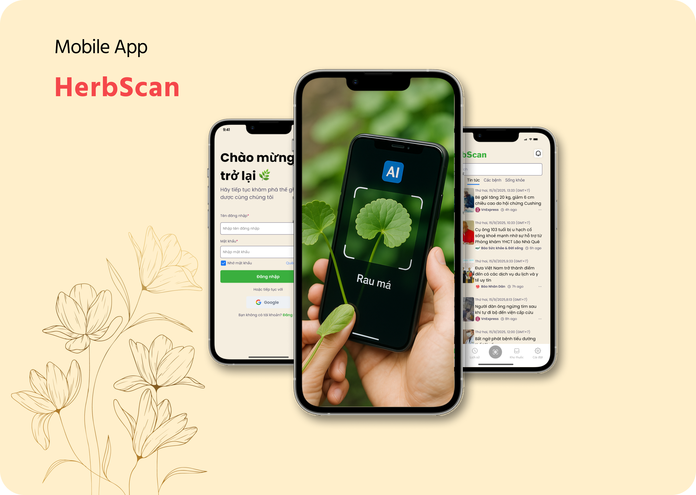

<!-- ======================= -->
<!-- 🌿 HerbScan: README HERO -->
<!-- ======================= -->

<!-- Banner: tự động đổi ảnh theo dark/light -->

  <picture>
    
  </picture>

<!-- Logo tròn + đổ bóng nhẹ (fallback khi không có banner) -->

  

<h1 align="center">🌿 HerbScan — Ứng dụng Nhận Diện Thảo Dược Việt Nam</h1>

  <i>Nhận diện thảo dược bằng AI, cung cấp công dụng – cách dùng, kho dữ liệu phong phú, tin tức sức khỏe tích hợp.</i>

<!-- Badges: đổi owner/repo của bạn -->

  
  
  
  
  

<!-- CTA buttons -->

  <!-- Đổi link APK/GitHub Pages/Docs theo dự án của bạn -->
  
  
  
  <a href="https://github.com/<owner>/<repo>/issues/new?template=bug_report.md"></a>
  <a href="https://github.com/<owner>/<repo>/issues/new?template=feature_request.md"></a>

<!-- Quick links -->

  <a href="#-gioi-thieu">Giới thiệu</a> • 
  <a href="#-tinh-nang-chinh">Tính năng</a> • 
  <a href="#-cong-nghe-su-dung">Công nghệ</a> • 
  <a href="#-cai-dat-nhanh">Cài đặt</a> • 
  <a href="#-screenshots">Screenshots</a> • 
  <a href="#-roadmap">Roadmap</a>

<!-- Highlight cards (3 cột) -->
<table align="center">
  <tr>
    <td align="center" width="33%">
      <b>🔍 Nhận diện AI</b> 
      TensorFlow Lite on-device 
      Không cần mạng khi nhận diện
    </td>
    <td align="center" width="33%">
      <b>📚 Kho thảo dược</b> 
      Công dụng • Cách dùng • Hình ảnh 
      Dữ liệu Việt hóa
    </td>
    <td align="center" width="33%">
      <b>📰 Tin tức Y tế</b> 
      VnExpress • SK&ĐS • Nhân Dân 
      RSS plug-and-play
    </td>
  </tr>
</table>

<!-- Divider đẹp -->

  

<!-- Neo đến phần bên dưới -->
